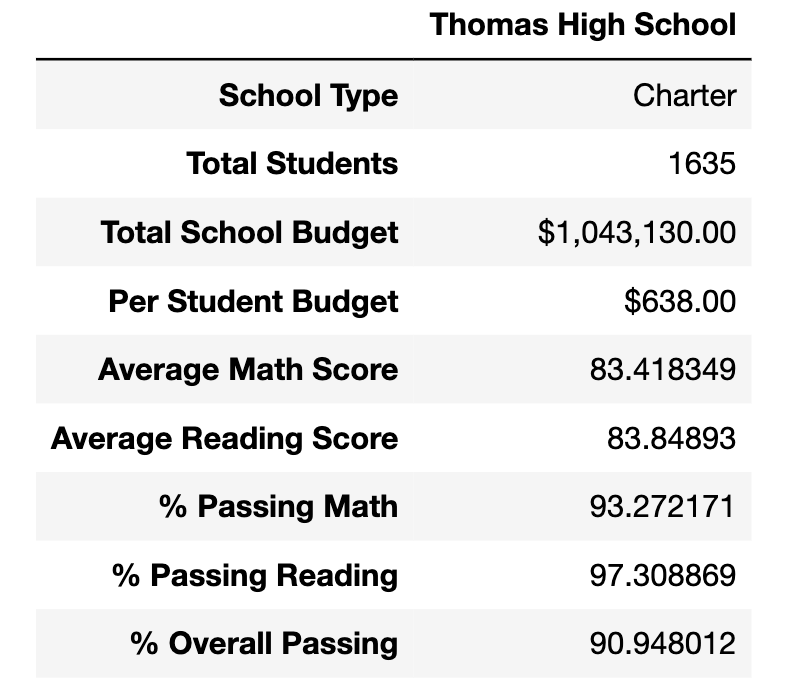
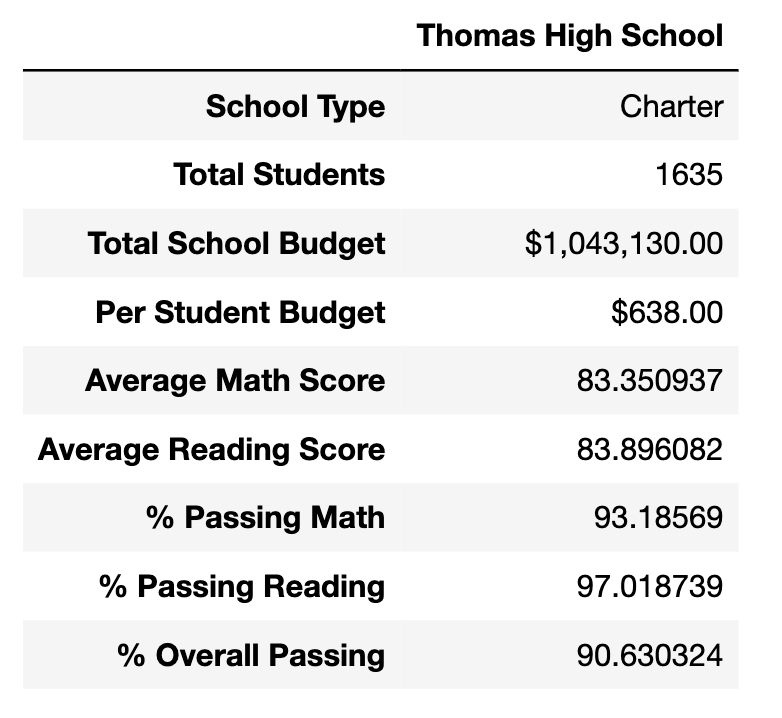

# School_District_Analysis

## Overview
In this project, we are tasked with analyzing standardized test data for several schools in the same school district, the goal being to find performance trends and patterns. This data will be used by the local school board to make decisions on school funding in the school district. The school board has provided us with school funding data and standardized test scores, which were separated into csv files containing  and . The  was performed using Python and Jupyter Notebook.

Two problems arose when analyzing the student data: 1) several student names contained incorrect prefixes and suffixes, such as MD or PhD. These misnomers were cleaned using basic string manipulation. 2) There were reports of cheating in the ninth grade class at Thomas High School (THS). As a result, standardized test scores had to be removed for these students, which altered the resulting statistics for THS.

## Results

After removing the 9th grade scores at THS, the rankings of each school remained the same. Rankings were determined by calculating the percentage of students who passed both the reading and math tests for each school. The top 5 schools are as follows:

* Cabrera 
* Thomas 
* Griffin 
* Wilson
* Pena

The bottom 5 school are as follows:

* Rodriguez
* Figueroa
* Huang
* Hernandez
* Johnson

As seen above, Thomas High School maintains its ranking as the 2nd top-scoring school. Since these ranking remained the same, removing the 9th grade scores at THS does not alter the overall analysis and therefore should not be included in the data presented to the school board. 

Even when looking at the scores and passing percentages of THS exclusively, there appears to be no significant difference before or after removing 9th grade scores. 

The differences in percent-passing are all 0.3% or less, and do not effect the school ranking for THS. 

In addition, the average score and percentages remain the same for:

* the spending bins
* the size bins
* between charter and district

## Summary

Despite having to remove the 9th grade scores for THS, the average test scores and passing percentages remained the almost exactly the same. Therefore, the data should be presented to the school board, though the removal of data should be noted during the presentation. 
